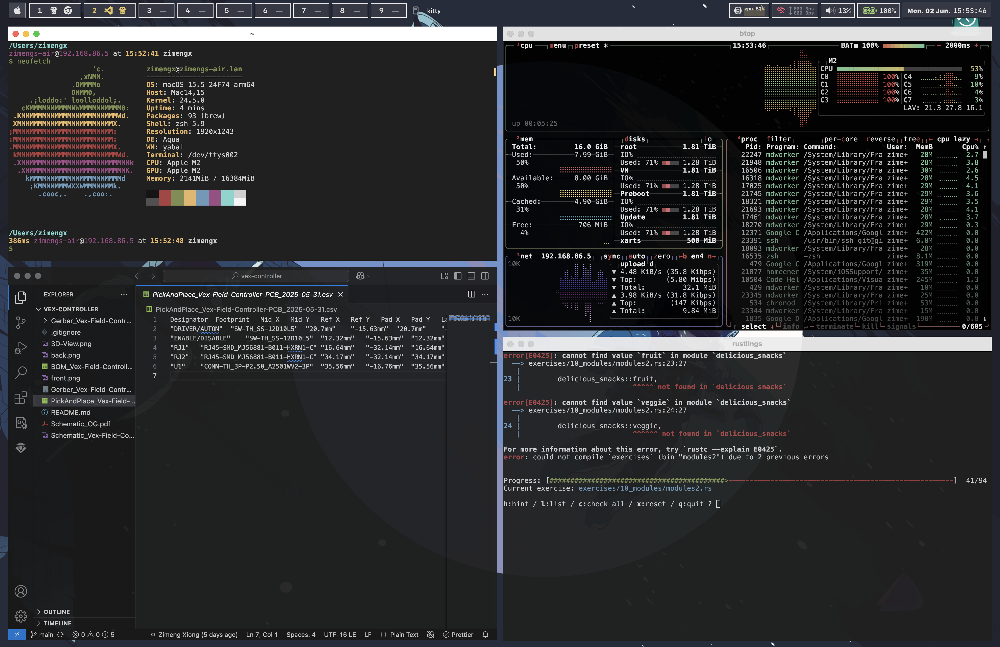
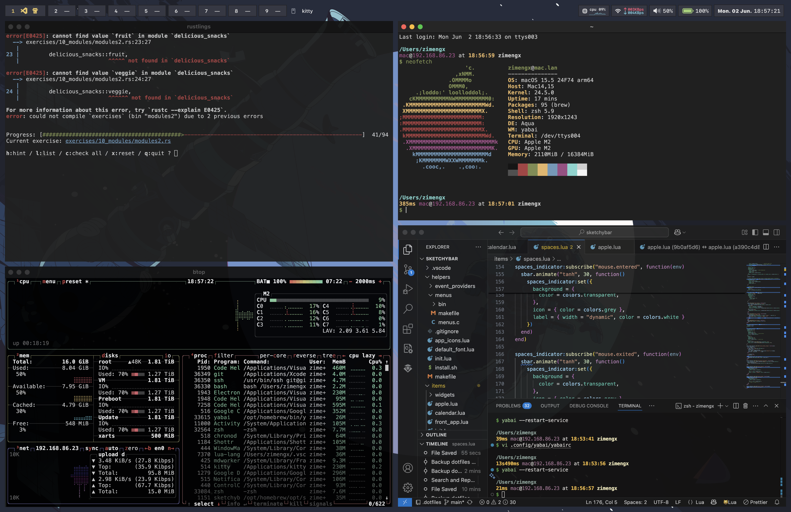
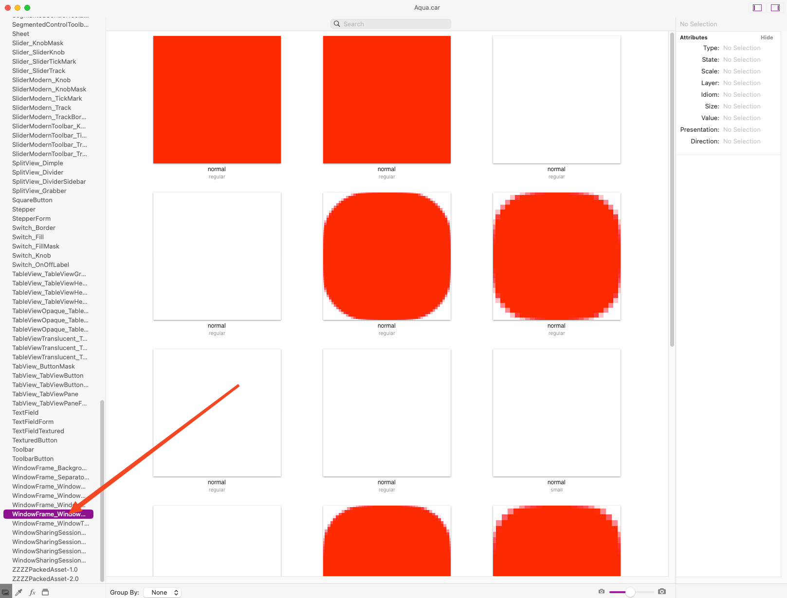
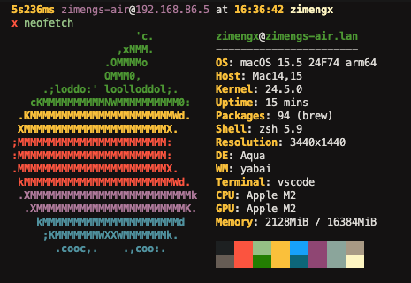

# MacOS Square Window Corners





# Installation

> [!CAUTION]
> Failure to properly backup your files, directly interacting with your system's filesystem, and interacting with asset files may leave your system in a irrecoverable state, and you will have to restore your Mac.

> [!CAUTION]
> This requires disabling System Integrity Protection on MacOS. System Integrity Protection protects some files and directories from being modified — even from the root user. To modify system assets, this requires you to disable SIP.

> [!WARNING]
> Backup your data!! This WILL leave your system in an unsupported state.

> [!IMPORTANT]
> This has only been tested on macOS Version 15.5, Build 24F74

> [!NOTE]
> When I was trying out different .car modifications, I accidentally bricked my system, and essentially all windows could not be visible. Reverting was a simple as a few terminal commands. Make sure you can access these commands on an another device just in case. SET UP SSH FROM ANOTHER DEVICE FIRST SO YOU CAN EASILY RUN TERMINAL COMMANDS FROM ANOTHER DEVICE.

## Backup your Files

Backup your system resources folder to at least two places, one of which being an external volume.

In addition, back up your entire computer or documents with Time Machine, or to another external disk.

```bash
cp -r /System/Library/CoreServices/SystemAppearance.bundle/Contents/Resources/ ~/Documents/resources_bak

cp -r /System/Library/CoreServices/SystemAppearance.bundle/Contents/Resources/ /Volumes/<your_external_drive>

## Incase you accidentally delete or overwrite one copy, when building the .car assets file
cp -r /System/Library/CoreServices/SystemAppearance.bundle/Contents/Resources/ ~/Desktop/resources_bak

cp -r /System/Library/CoreServices/SystemAppearance.bundle/Contents/Resources/ ~/.resources_bak
```

> [!WARNING]
> You should not blindly trust me and the Assets.car file in this repo. You should never trust anyone to tells you to disable SIP and run arbitrary commands. You should never trust anyone who tells you to place arbitrary files into arbitrary places, always research commands and build executables when possible. It is always best to build your own from the files based on your own system.

## Building your own Assets.car file

> [!NOTE]
> The steps are the same for Dark Mode as Light Mode. Make sure you replace DarkAqua.car and NOT Aqua.car, otherwise you will LOSE your light theme.

1. Install [Theme Engine](<https://github.com/jslegendre/ThemeEngine/releases/download/v1.0.0(119)/ThemeEngine.zip>), a .car viewer and [AssetCatalogTinkerer](https://github.com/insidegui/AssetCatalogTinkerer), a .car image exporter
2. Open `/System/Library/CoreServices/SystemAppearance.bundle/Contents/Resources/Aqua.car` with AssetCatalogTinkerer, and export all the images starting with `WindowFrame_WindowShapeEdges`
3. Navigate to the `WindowFrame_WindowShapeEdges`
4. Navigate to the same folder in ThemeEngine, and navigate to the `WindowFrame_WindowShapeEdges` tab.

   

5. Edit all so that the viewbox is filled with that color instead of having a corner radius, you can do this with a variety of photo edit tools, like PREVIEW, [Gimp](https://www.gimp.org/), Photoshop, Figma, etc, etc.
6. Drag and drop the edited images into the boxes.
7. Save as in ThemeEngine (⌘⇧S) as "Aqua.car" in your Root directory

> [!TIP]
> The white boxes may look blank, but click on them and you should see the gray pattern in the box.

## Check macOS Version

For best results, you should be running similar hardware and software:

```

MacOS 15.5 24574 arm64

```



## Disable SIP

> [!CAUTION]
> Disabling SIP reduces the system's protection against malicious software by allowing modifications to protected files and directories by root users

Open Terminal in Recovery Mode.

```bash
# Disables SIP
$ csrutil disable

# Disables the authenticated root volume
$ csrutil authenticated-root disable
```

## Mount the filesystem to a mount point

### Identify the System Volume Disk

```bash
$ mount | grep "on / "
/dev/disk3s3s1 on / (apfs, sealed, local, read-only, journaled)
```

The system disk will be the volume minus `sX`, ie `/dev/disk3s3`

---

This can also be found in one command:

```bash
$ df / | tail -1 | awk '{print $1}' | sed 's/s[0-9]*$//'
/dev/disk3s3
```

---

### Create the mount point

```bash
mkdir ~/live_disk_mnt
```

### Mount to the mount point

```bash
sudo mount -o nobrowse -t apfs  <your system disk> ~/live_disk_mnt
```

## Copy the .car assets file to the mounted filesystem

```bash
cp <where_your_asset-car_file_size> ~/live_disk_mnt/System/Library/CoreServices/SystemAppearance.bundle/Contents/Resources/Aqua.car
```

## Bless the filesystem (ie make sure your Mac boots from the modified filesystem)

```bash
sudo bless --mount ~/live_disk_mnt --bootefi --create-snapshot
```

## Restart your computer

```bash
sudo shutdown -r now
```

# How to restore your computer

## Switch Themes

If you modded light mode, go to system->appearances then switch to dark mode, and vice versa, since the two themes are defined in separate files.

## Otherwise

If you lose access to windows, try SSHing into your computer

1. Get your backup file and copy it to the computer in a safe location
2. Open a terminal, follow the instruction to mount the volume.
3. Copy the backup `Aqua.car` file into `~/live_disk_mnt/System/Library/CoreServices/SystemAppearance.bundle/Contents/Resources/Aqua.car` instead of the patched `Aqua.car` file
4. Bless and restart as usual

## Credits

https://github.com/jslegendre/ThemeEngine

https://github.com/insidegui/AssetCatalogTinkerer

© Zimeng Xiong
